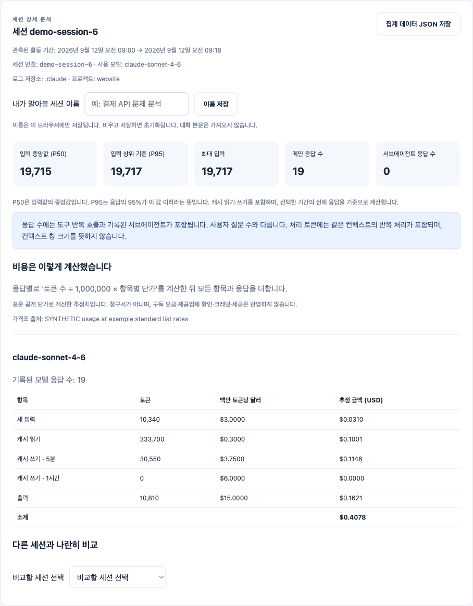

# TraceFrugal

**AI 입력이 왜 큰지 확인하고, 컨텍스트를 줄여 본 뒤, 답변이 여전히 유용한지 비교하세요.**

[English](README.md) · [한국어 데모](https://niceysam.github.io/tracefrugal/?lang=ko) ·
[다운로드](https://github.com/niceysam/tracefrugal/releases/latest) ·
[화면 사용 안내](docs/session-inspector.ko.md)

Claude Code와 Codex의 로컬 사용 기록을 한 화면에서 봅니다.
토큰 그래프·세션별 비용 계산식·큰 도구 결과·반복 호출을 확인하고,
지침 하나를 24시간 시험해 사용량과 **답변·추론 만족도**를 비교합니다.
필요하면 되돌리고 이력은 남깁니다. 모델을 바꾸라는 추천이 목적이 아닙니다.

**Go 실행 파일 하나. API 키·회원가입 없이 시작합니다. 원격 분석 서버로 데이터를 보내지 않습니다.**

## 실제 환경 최적화 — 적용, 비교, 원복

```sh
tracefrugal optimize --project /작업/프로젝트
```

**CLI 버전·공식 문서 확인 → 적용 클릭 → 평소처럼 작업 → 결과 비교 → 유지 또는 원복**

프로젝트 설정을 백업한 뒤 Claude의 큰 MCP 결과 제한을 낮춥니다.
새 세션에서 설정값이 실제 적용됐는지 확인하고,
시간별 입력·캐시·출력·호출 수·답변 만족도를 비교합니다.
원복하면 원본 설정 파일을 복원하고, 재적용하면 새 실험을 만들며 이력은 남깁니다.
브라우저는 내 컴퓨터에서 실행되는 프로그램의 조작 화면입니다.

**실험 기능:** 현재 검증 버전은 Claude Code **2.1.268**입니다.
다른 버전은 조회만 가능하며 모델·권한을 바꾸지 않습니다.
작은 결과에는 효과가 없을 수 있고 추가 읽기로 비용이나 품질이 악화될 수도 있습니다.
[실제 CLI 시험 결과와 실패 기록](docs/optimizer-validation.md)을 공개합니다.
짧은 시험을 하루 동안의 개발 생산성 검증으로 포장하지 않습니다.

**[사용 방법 →](docs/local-optimizer.ko.md)**

## 바로 사용하기

1. [내 컴퓨터용 파일](https://github.com/niceysam/tracefrugal/releases/latest)을 받고 압축을 푸세요.
2. 그 폴더의 터미널에서 실행하세요.

```sh
./tracefrugal
```

Windows에서는 `.\tracefrugal.exe`를 실행합니다.
Mac Apple Silicon은 `darwin_arm64`, Intel Mac은 `darwin_amd64`를 선택하세요.
브라우저가 열리지 않으면 터미널에 표시된 로컬 주소를 여세요.
계속 갱신하려면 터미널을 켜 두세요. macOS 배포 파일은 공증되지 않았으므로
실행 차단 시 출처를 확인한 뒤 개인정보 보호 및 보안 설정에서 판단하세요.

3. 화면 위쪽에서 **한국어**를 고르세요.
4. 저장소와 기간을 고른 뒤 **세션 행**을 누르세요.

`~/.claude`, `~/.codex`와 해당 이름 뒤에 `-*`가 붙는 로컬 폴더,
`CLAUDE_CONFIG_DIR`, `CODEX_HOME`을 찾습니다. 같은 기록의 사본은 중복 집계하지 않습니다.
실행 별칭이 여러 개라도 같은 저장소를 쓰면 한 번만 집계합니다.
계정·구독·실행 별칭까지 식별하는 기능은 아닙니다.

사용자 지정 경로를 하나라도 지정하면 자동 탐색을 대체합니다.
필요한 저장소를 모두 명시하세요.

```sh
tracefrugal watch --claude-dir /path/to/claude --codex-dir /path/to/codex
```

## 무엇을 볼 수 있나요?

[](https://niceysam.github.io/tracefrugal/?lang=ko)

| 알고 싶은 것 | 화면에서 |
|---|---|
| 짧게 질문했는데 입력이 왜 많나? | 3단계 흐름 그림과 요청 횟수 슬라이더 |
| 이름이 같은 두 세션의 차이는? | 고유 번호·모델·활동 기간·직접 지정한 이름 |
| 비용이 어떻게 나온 건가? | 새 입력·캐시 읽기·캐시 쓰기·출력별 토큰 × 단가 |
| 유난히 큰 요청이 있나? | 입력 중앙값·P95·최댓값과 응답별 그래프 |
| MCP를 어떻게 줄이나? | 도구 검색·조회 범위 축소·큰 결과 원문 보관·재조회 안내 |
| 반복 호출을 줄일 수 있나? | 결과 크기와 동일 호출 반복 신호 |
| 줄였더니 답변이 나빠지지 않았나? | 24시간 전후 비교와 사용자 만족도 1–5점 |
| 원래대로 돌아갈 수 있나? | 지침 제거 또는 프록시 축소 중단. 이력은 보존 |

**질문이 짧아도 이전 답변·도구 결과가 다음 요청의 입력이 될 수 있습니다.**
‘화면에 출력된 글자’와 ‘모델이 생성한 출력 토큰’은 같은 개념이 아닙니다.
[그림과 계산식으로 이해하기 →](docs/session-inspector.ko.md)

## 실제 결과 축소 시험

기존 stdio MCP 서버 앞에 프록시를 붙일 수 있습니다.
명시적으로 허용하고 읽기 전용으로 표시된 도구의 큰 텍스트 결과를 로컬에 보관하고,
모델에는 발췌문과 원문 재조회 도구를 제공합니다.

```sh
tracefrugal pack --state /path/to/private-trial --allow search_docs -- /path/to/mcp-server --stdio
tracefrugal watch --pack-state /path/to/private-trial
```

첫 명령을 실행 환경의 MCP 서버 설정에 넣어 연결해야 실제 호출에 적용됩니다.
위 명령만 복사한다고 모든 연결 도구가 자동으로 바뀌지는 않습니다.
최대 24시간 뒤 새 결과 축소를 멈추며, 화면에서 먼저 중단할 수도 있습니다.
이미 대화에 들어간 내용을 지우거나 도구 정의를 제거하는 기능은 아닙니다.
[설정·적용 조건·원복 범위](docs/mcp-pack.md)

## 지원 범위와 해석

Claude Code·Codex **로컬 로그**를 지원합니다. ChatGPT 웹 대화와 Claude Desktop은
자동으로 가져오지 않습니다. OpenAI·Anthropic API 앱은 별도의 기록기·평가기 통합으로
사용할 수 있습니다. [API 예제 화면](https://niceysam.github.io/tracefrugal/experiments.html?lang=ko)

비용은 날짜가 표시된 표준 단가 추정치이며 청구서가 아닙니다.
확인할 수 없는 단가와 Codex 로컬 비용은 미산정으로 남깁니다.
도구 결과의 바이트는 토큰 기여도가 아니고, 캐시 읽기가 많다고 낭비인 것도 아닙니다.
사용량이 줄었더라도 작업·정확성·만족도가 달라졌다면 절감을 입증한 것이 아닙니다.

공개 데모는 **가상 데이터**입니다. 실제 24시간 절감 실험을 수행했다는 주장은 하지 않습니다.
앱의 지침 시험은 준수를 강제하지 않으므로 새 Claude 세션의 `/context`에서 로딩을 확인하세요.
지침은 24시간 뒤 자동 삭제되지 않으며 직접 원복해야 합니다.

MIT 오픈소스. [기여 안내](CONTRIBUTING.md) · [보안과 데이터 범위](SECURITY.md)
