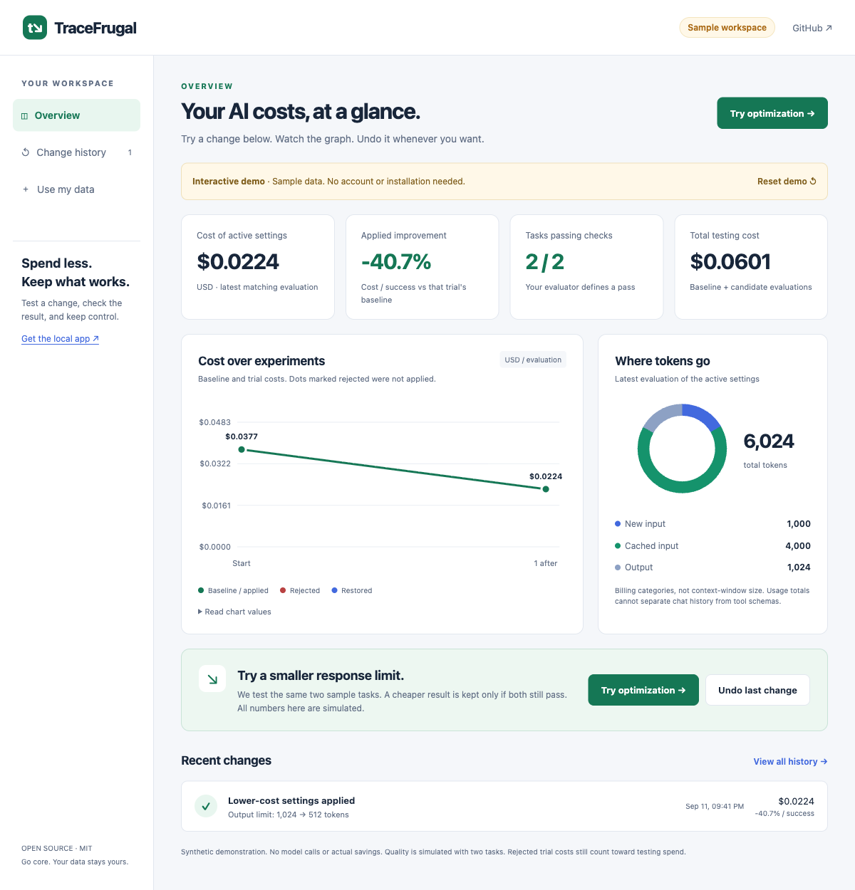

# TraceFrugal

### See your AI costs. Try a change. Undo it.

<p><a href="https://niceysam.github.io/tracefrugal/"><strong>Open the dashboard →</strong></a> · <a href="https://github.com/niceysam/tracefrugal/releases/latest">Download the local app</a> · <a href="docs/providers.md">Provider support</a></p>
<p align="center">
  <a href="https://github.com/niceysam/tracefrugal/actions/workflows/ci.yml"></a>
  <a href="https://github.com/niceysam/tracefrugal/releases"></a>
  <a href="LICENSE"></a>
  
</p>

**See where your AI tokens go. Reduce cost. Verify quality.**

TraceFrugal shows your recorded usage in a local dashboard, suggests optimization experiments, and checks whether changes reduce **estimated token cost per successful task**. It distinguishes cached input from new input and fails CI when costs rise or a previously passing task fails.

**One Go binary. No runtime dependencies. No API key. No outbound network calls.**

## Try it in your browser

**[Open the interactive dashboard](https://niceysam.github.io/tracefrugal/)** — no install, sign-up, or API key.

1. See costs and token categories in the graphs.
2. Click **Try optimization**. A simulated trial updates the cost, checks, and history.
3. Click it again to see a cheaper candidate rejected when quality fails.
4. Click **Undo last change** to restore the previous setting and pause trials.

The public demo uses synthetic data. It does not connect to an AI account or generate actual savings.
**Use my data** opens a report file locally in your browser or guides you through connecting an API application.

[](https://niceysam.github.io/tracefrugal/)

## Run the local app

[Download the binary for your system](https://github.com/niceysam/tracefrugal/releases/latest), extract it, and run:

```sh
./tracefrugal demo
```

On Windows, use `.\tracefrugal.exe demo`. Open **http://127.0.0.1:8765/**.
No config, Python, Git clone, or API account is needed for this demo.
It simulates two successful optimizations and a rejected one. Click **Undo last change**, then **Restore & pause** to try rollback. **Allow experiments again** clears the pause. Only demo files change.

Ready for real usage? Follow the [API connection walkthrough](docs/live-dashboard.md).

## Watch your own usage

Connect the [SDK recorder](examples/record_usage.py) to your OpenAI Responses or Anthropic Messages application, supply your model prices, then run:

```sh
tracefrugal serve --trace run.jsonl --prices prices.json
```

Open **http://127.0.0.1:8765/** for token and task-cost charts, estimated spend, cache usage, and task outcomes. Data updates every three seconds without reloading the page.

[Connection walkthrough and limitations →](docs/live-dashboard.md)

This requires instrumentation in your application. It does not automatically attach to Claude Code, Codex, ChatGPT or Claude Desktop. Usage totals alone cannot separate tool schemas from conversation history.

## Try, apply, or roll back an optimization

```sh
tracefrugal experiment --config examples/experiment/experiment.json --state runs/demo
tracefrugal serve --state runs/demo
```

This alternative example needs Python 3 and makes no model calls. The experiment runner generates a smaller output cap, evaluates it, and updates a managed profile only if cost per success falls without new task failures. The visual dashboard records each decision and provides a rollback button. Rollback pauses automation.

For real apps, connect an evaluator and make your app consume the active profile. Use `--every 1h --max-runs 24` for recurring evaluations. API evaluations incur their own costs.

[Automatic experiments, hourly results and rollback →](docs/experiments.md)

**Prefer a visual report?** [Open the example](https://niceysam.github.io/tracefrugal/example-report.html): costs side by side, plain-English reasons, and each task's result. Reports are a single offline HTML file.

## Why token counts can mislead

A smaller prompt can cost more if it loses cache reuse. A cheaper run can be worse if it stops solving the task.

These checked-in **synthetic fixtures** use hypothetical prices, not measured provider performance:

| Run | Input tokens, including cache reads | Successful tasks | Estimated token cost | Gate |
|---|---:|---:|---:|---|
| Baseline | 1,020,000 | 2/2 | $0.66 | Reference |
| Smaller input, no cache hits | 400,000 | 2/2 | $2.06 | **FAIL: +212.12% cost per success** |
| Smaller input, cache retained | 210,000 | 2/2 | $0.21 | **PASS: −68.18% cost per success** |
| Same savings, one wrong answer | 210,000 | 1/2 | $0.21 | **FAIL: task regression** |

The fixtures contain two requests each. The million-token figure is a **run total**, not a context-window size.

## Try it in a minute

Install with Go:

```sh
go install github.com/niceysam/tracefrugal/cmd/tracefrugal@latest
```

Or download a binary for macOS, Linux, or Windows from [Releases](https://github.com/niceysam/tracefrugal/releases). Verify its archive against `checksums.txt`.

Clone the examples:

```sh
git clone https://github.com/niceysam/tracefrugal.git
cd tracefrugal

tracefrugal report \
  --trace examples/baseline.jsonl \
  --prices examples/prices.json

tracefrugal compare \
  --baseline examples/baseline.jsonl \
  --candidate examples/candidate-cache-miss.jsonl \
  --prices examples/prices.json
```

The second command **intentionally exits 1**:

```text
FAIL — cost and task-outcome regression gate
Prices: SYNTHETIC demo rates — not a real provider price list (USD per million tokens)
Baseline:  $0.660000 | 2/2 successful | 2 requests
Candidate: $2.060000 | 2/2 successful | 2 requests
Cost per success: +212.12% (allowed increase: 5.00%)
- cost per success exceeded the allowed increase
Estimated token cost only; not an invoice or a statistical significance test.
```

Replace `candidate-cache-miss.jsonl` with `candidate-good.jsonl` to see a passing comparison. Use `candidate-quality-loss.jsonl` to see a cheaper run fail the quality gate.

You can run the same commands from source with `go run ./cmd/tracefrugal` instead of `tracefrugal`. The Go runner wraps nonzero child exit codes; **use the compiled binary in CI**.

## Bring your own usage, not your prompts

TraceFrugal consumes JSONL with two event types:

```jsonl
{"type":"request","task_id":"invoice-001","request_id":"req-001","model":"demo/model","tokens":{"input":10000,"cached_input":500000,"output":2000}}
{"type":"task_result","task_id":"invoice-001","success":true}
```

- Emit **one request event per model call**, using its final usage. Include retries, tool-loop calls, and subagent calls if they belong to the task.
- Emit **one task result per task**, produced by your tests, benchmark grader, or human review.
- Token categories are **disjoint**. `input` means uncached input, not total input.
- `task_id` must identify the same test case in both runs. Request IDs must be unique within each trace.
- No prompts, model responses, source code, or credentials are required.

Supply an explicit price book in **USD per million tokens**:

```json
{
  "schema_version": 1,
  "currency": "USD",
  "label": "Hypothetical example — replace with your applicable rates",
  "models": {
    "demo/model": {
      "input": 5,
      "cached_input": 0.5,
      "cache_write": 6.25,
      "cache_write_1h": 10,
      "output": 15
    }
  }
}
```

An unknown model or a missing rate for a **used** token category is an error. Free usage requires an explicit `0` rate. There are no silently guessed provider prices.

For long-context, regional, batch, or contracted rates, use separate model keys such as `provider/model@long-context` and map each request to the applicable rate class yourself. TraceFrugal does not infer pricing tiers.

## Open a report in your browser

```sh
tracefrugal compare \
  --baseline examples/baseline.jsonl \
  --candidate examples/candidate-cache-miss.jsonl \
  --prices examples/prices.json \
  --format html > comparison.html
```

Open `comparison.html` in any browser. The intentionally failing comparison still writes a complete report and exits `1`. For a single run, use `report --format html`.

The report answers three questions: **What did we spend? Why did the gate fail? Which tasks stopped passing?** It embeds all styling, uses no JavaScript, and loads no external assets.

## Does it work with my model?

| Your input | Support |
|---|---|
| OpenAI Responses final JSON | Automatic usage normalization |
| Anthropic Messages final JSON | Automatic usage normalization |
| Any provider in TraceFrugal JSONL | Common accounting and reporting |
| Gemini, Bedrock Converse, Ollama raw responses | Convert to the common format yourself |
| Claude Code / Codex native session logs | No native importer yet |

**An agent app and a model provider are different things.** Using Claude Code does not mean its session log is an Anthropic Messages response. See [the compatibility guide](docs/providers.md).

### Normalize a provider response

Two small adapters can convert supported final response objects into request events:

```sh
tracefrugal normalize \
  --provider openai \
  --task invoice-001 \
  --response response.json > request.jsonl
```

`--provider anthropic` accepts Anthropic Messages usage. `--response -` reads stdin. Add the independently evaluated `task_result` event before comparison.

**Adapter boundaries:** OpenAI Responses cache reads and `cache_write_tokens` are supported. Anthropic nonzero cache writes require an explicit 5-minute/1-hour breakdown. Streaming events, Chat Completions, and native Claude Code/Codex session logs are not imported. See [the format and adapter contract](docs/format.md).

## Put it in CI

Generate `runs/baseline.jsonl` and `runs/candidate.jsonl` using your own evaluation runner, then:

```sh
tracefrugal compare \
  --baseline runs/baseline.jsonl \
  --candidate runs/candidate.jsonl \
  --prices prices.json \
  --max-increase 5 \
  --format json > comparison.json
```

| Exit code | Meaning |
|---|---|
| `0` | Report completed, or comparison passed |
| `1` | Cost or task-outcome regression |
| `2` | Invalid input, incomplete comparison data, or CLI error |

The gate requires identical task sets and complete outcomes. It fails on **any newly failed task**, even when the aggregate success rate is unchanged. A run with zero successes cannot pass.

See [GitHub Actions integration](docs/ci.md).

## What it measures

```text
estimated token cost =
    uncached input × input rate
  + cached input × cache-read rate
  + cache writes × applicable cache-write rate
  + output × output rate

cost per success = all token spend / number of successful tasks
```

Failed-task spend stays in the numerator. Reasoning tokens already included in a provider's output count must not be added again.

`report --format json` also includes each task's cost, request count, outcome, and summed request duration when provided. Summed request durations are **not wall-clock latency** when calls overlap.

The experiment runner executes your evaluator and can activate a managed configuration. It does not grade correctness itself, compress context, reconcile invoices, or compute statistical significance. It cannot verify that your trace captured every billed request or that your application consumed the profile.

## How it fits

Use TraceFrugal **with** optimization tools:

- [RTK](https://github.com/rtk-ai/rtk) reduces command output.
- [Headroom](https://github.com/headroomlabs-ai/headroom) compresses agent context and offers related diagnostics.
- [LLMLingua](https://github.com/microsoft/LLMLingua) researches prompt compression.
- Your provider's native tool search and prompt caching can reduce overhead.

TraceFrugal's narrow job is to apply the **same explicit cost and task-outcome contract** to baseline and candidate runs. Other products offer overlapping features; this project does not claim to be the first.

## Limits and honest comparisons

- Costs are estimates from your rate file. Tool charges, storage, infrastructure, taxes, subscription allowances, and volume discounts are excluded unless already reflected in applicable token rates.
- Compare the same task inputs and grading rules. Record model settings, tool versions, and cache conditions with your experiment.
- Repeat stochastic tasks. A single pair of runs is not proof of a general improvement.
- Missing outcomes are displayed as unknown by `report`; `compare` rejects them.
- USD computations use IEEE 754 floating point. This tool is not a financial settlement system.
- Native session-log import and built-in graders are not shipped features. Automatic experiments require your evaluator and profile integration.

Read [measurement methodology](docs/methodology.md) before publishing savings claims.

## Development

Go 1.23 or later:

```sh
go test -race ./...
go vet ./...
go build -o bin/tracefrugal ./cmd/tracefrugal
```

Contributions are welcome, particularly anonymized **usage-only** fixtures, provider accounting edge cases, and reproducible failure reports. See [CONTRIBUTING.md](CONTRIBUTING.md).

MIT licensed. Built for developers working across models, tools, and languages.
