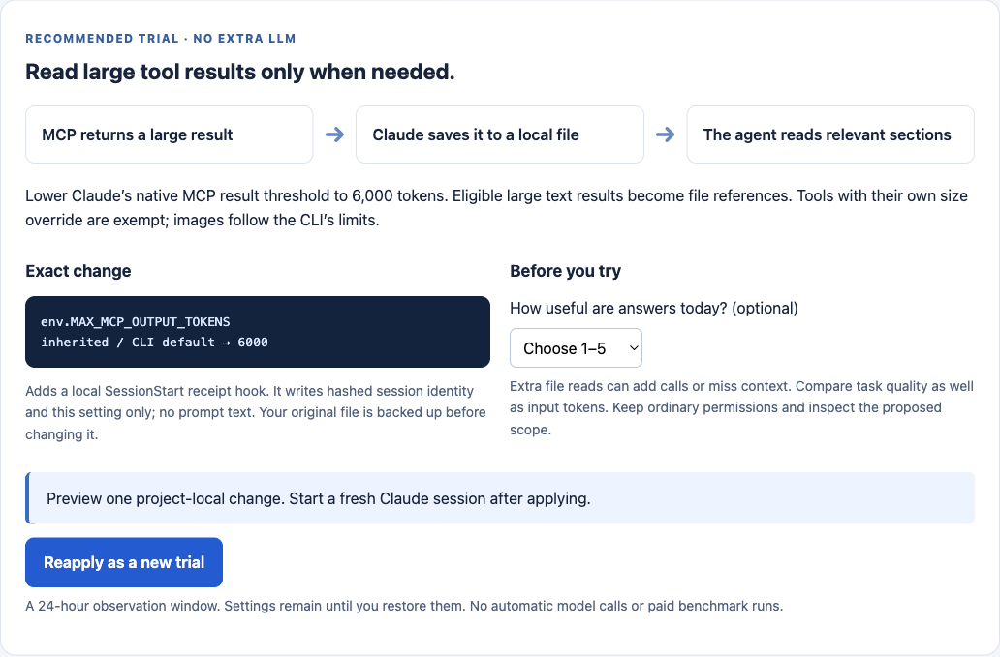
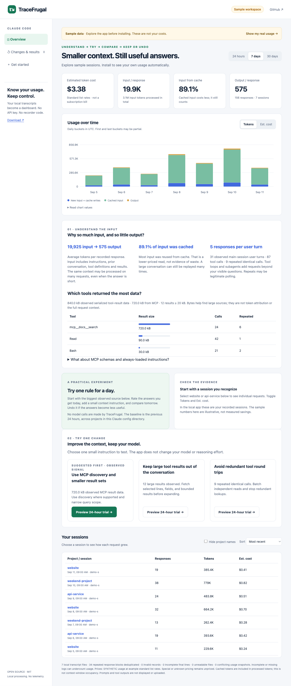
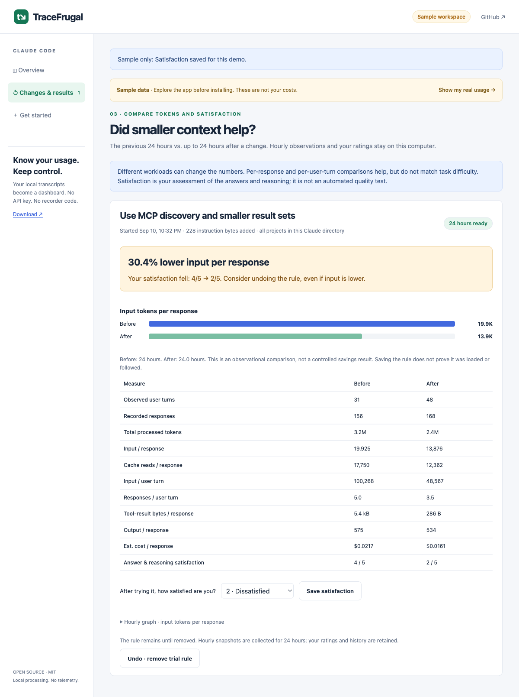
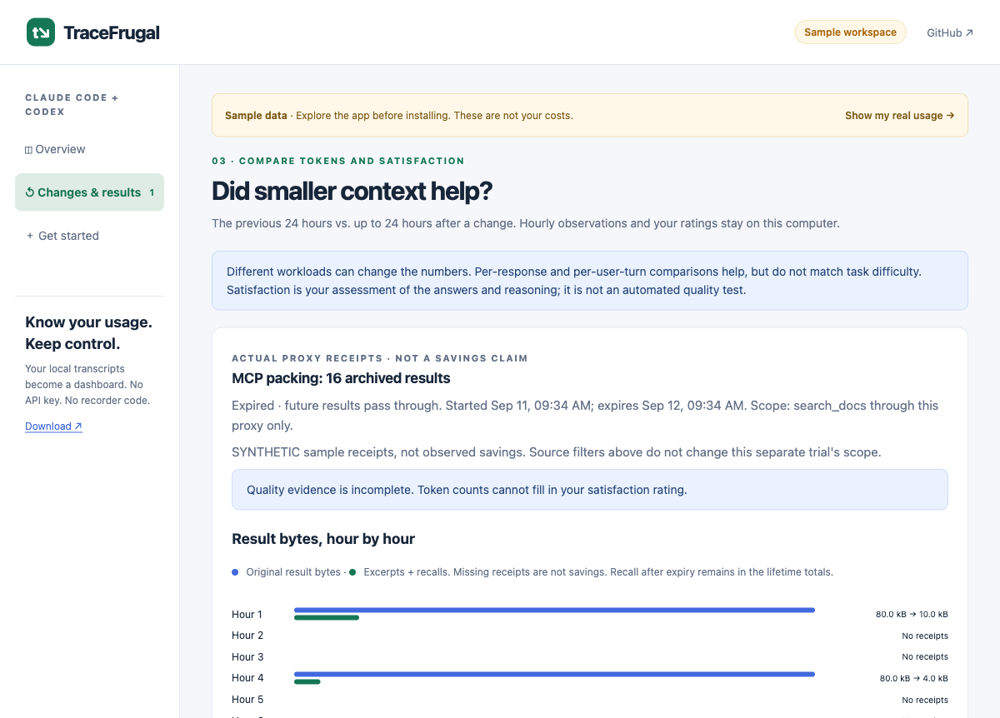

# TraceFrugal

[English](README.md) · **[한국어](README.ko.md)** ·
[English dashboard](https://niceysam.github.io/tracefrugal/?lang=en) ·
[한국어 대시보드](https://niceysam.github.io/tracefrugal/?lang=ko)

### Understand large AI inputs. Try smaller context. Keep useful answers.

<p><a href="https://niceysam.github.io/tracefrugal/"><strong>Open the dashboard →</strong></a> · <a href="https://github.com/niceysam/tracefrugal/releases/latest">Download the local app</a> · <a href="docs/providers.md">Provider support</a></p>
<p align="center">
  <a href="https://github.com/niceysam/tracefrugal/actions/workflows/ci.yml"></a>
  <a href="https://github.com/niceysam/tracefrugal/releases"></a>
  <a href="LICENSE"></a>
  
</p>

**Run `tracefrugal`. Your browser opens. Your own sessions appear.**

TraceFrugal brings **Claude Code and Codex stores into one local dashboard**
and shows why your workflow may process so much input:
large tool results, repeated calls, and context reused across responses.
Try a small context rule for a day, compare tokens **and your answer satisfaction**,
then keep it or undo it. An opt-in **MCP proxy actually archives large
read-only results**, provides exact recall, and stops packing after 24 hours.
You don't need a different LLM.

**One Go binary. No runtime dependencies. No API key. No telemetry.**

## Optimize your own Claude — not just a chart

```sh
tracefrugal optimize --project /path/to/your/project
```

**Check CLI version & official docs → Apply → Work normally → Compare → Keep or restore.**

The local app backs up your project settings, lowers Claude's native large-MCP
result threshold, and verifies the effective setting when a fresh session starts.
Compare hourly input, cache, output, call counts and answer satisfaction.
Restore recreates the original file; reapply starts a new trial with retained history.
The browser is the local control panel. No hosted service receives your data.

**Experimental, version-gated:** currently reviewed for Claude Code **2.1.268**.
Other versions stay diagnostic-only. No model or permission changes. Small results
may be unaffected; additional retrieval can make a task more expensive or worse.
See the **[real CLI test results](docs/optimizer-validation.md)**, including failures.
These bounded tests are not a day of developer productivity evidence.

[Start here →](docs/local-optimizer.md) · [한국어 사용법 →](docs/local-optimizer.ko.md)

[](docs/local-optimizer.md)

## See it before installing

**[Open the interactive dashboard](https://niceysam.github.io/tracefrugal/)** — no install, sign-up, or API key.

1. Choose **All sources**, Claude Code, or Codex; inspect input/cache/output.
2. Read recommendations for context, MCP and round trips.
3. Select a Claude source to preview a rule, or inspect the sample MCP
   packing trial's hourly bytes and answer satisfaction.

The public demo uses synthetic data. It does not connect to an AI account or generate actual savings.

[](https://niceysam.github.io/tracefrugal/)

## Get your own graph

[Download the binary for your system](https://github.com/niceysam/tracefrugal/releases/latest), extract it, and run:

```sh
./tracefrugal
```

On Windows, use `.\tracefrugal.exe`. The browser opens automatically.
Choose `darwin_arm64` for Apple Silicon Macs, `darwin_amd64` for Intel Macs,
or the corresponding Windows/Linux architecture. Keep the terminal running.

TraceFrugal finds `~/.claude`, `~/.codex`, their `-*` sibling stores and
`CLAUDE_CONFIG_DIR` / `CODEX_HOME`. It deduplicates copied responses and displays
the last seven days. Source cards show missing, partial and unreadable data.
It refreshes every 30 seconds.
An optional trial adds one clearly previewed instruction file after confirmation.

**[Setup, supported sources, accounting and coverage →](docs/native-usage.md)**

No local logs yet? The app explains how to start. macOS may ask you to approve
the downloaded binary in Privacy & Security; releases are not notarized.

## What you can do

| Your question | In TraceFrugal |
|---|---|
| Where did my usage go? | 24-hour, 7-day, and 30-day graphs; session sorting |
| Are all my local workspaces counted? | Per-store coverage and freshness; shared receipts count once |
| Is this conversation growing expensive? | Select the session; inspect request input, cache reads, and output |
| Why is input huge when output is small? | Per-response input/output, cache explanation, tool-result byte sources, repeated calls |
| What can I change about MCP or tools? | Three concrete, previewable context rules; no model or effort changes |
| Did it help over a day? | Previous 24 hours vs. next 24 hours; hourly graph; input and cost per response; input and responses per user turn |
| Were the answers still useful? | Your before/after answer and reasoning satisfaction, rated 1–5 |
| Can I go back? | Remove the trial rule, with external-edit protection; history stays |
| Can it really reduce tool results? | Opt-in read-only MCP result packing, exact recall, hourly receipts and stop |
| Which session is this? | Distinct session IDs, local names, models, observed activity and search |
| How was this dollar amount calculated? | Per-model token × rate tables with explicit reasons for unpriced data |
| What can a developer investigate? | Input P50/P95/max, main/subagent counts, side-by-side sessions and aggregate JSON export |

Both dashboards support English and Korean offline. Open **My question was
short. Why is input so large?** for a visual explanation of how tool results
and retained answers become input again.
[Session inspector and cost guide →](docs/session-inspector.md)

**Honest boundaries:** dollars are dated list-price estimates, not subscription
bills. Unknown pricing stays visibly unpriced. A lower hourly total is not proof
of savings: the work and its quality may have changed. Tool-result bytes are
**not input-token attribution**; logs do not expose exact schema/memory shares.
Rules guide Claude's behavior, not enforce it. Confirm loading with `/context`
in a fresh session. The rule stays active until removed. Native trials do not
automatically grade answers or guarantee savings.

[](https://niceysam.github.io/tracefrugal/)

## Try actual MCP result packing

Wrap one existing **stdio MCP server** with `tracefrugal pack`. Explicitly
allowlist read-only tools. Large eligible text results are archived locally;
the model gets an excerpt and an exact recall tool.

```sh
tracefrugal pack --state /path/to/private-trial --allow search_docs -- /path/to/mcp-server --stdio
```

Use the wrapper in your host's MCP configuration, then open its receipts:

```sh
tracefrugal watch --pack-state /path/to/private-trial
```

After 24 hours, future results pass through. **Undo** stops earlier and keeps
history and recall. The graph includes recall traffic; fewer bytes are **not**
measured billed-token savings. The proxy cannot unload host schemas or rewrite
existing history. Full originals stay in the private archive.

**[Exact setup, scope, retention and limitations →](docs/mcp-pack.md)** ·
[What we learned from NVlabs SoL-Pi](docs/sol-pi-design.md)

[](https://niceysam.github.io/tracefrugal/)

## For API application developers

The provider-independent recorder, cost-per-success regression gate, and
automatic evaluator-driven experiments remain available. These are a separate
workflow from the native Claude Code dashboard.

Connect the [SDK recorder](examples/record_usage.py) to your OpenAI Responses or Anthropic Messages application, supply your model prices, then run:

```sh
tracefrugal serve --trace run.jsonl --prices prices.json
```

Open **http://127.0.0.1:8765/** for token and task-cost charts, estimated spend, cache usage, and task outcomes. Data updates every three seconds without reloading the page.

[Connection walkthrough and limitations →](docs/live-dashboard.md)

This API workflow requires instrumentation. Claude Code uses the separate native
importer above; Codex also has a native local importer. ChatGPT and Claude
Desktop are not natively imported.
Usage totals alone cannot separate tool schemas from conversation history.

## Try, apply, or roll back an optimization

```sh
tracefrugal experiment --config examples/experiment/experiment.json --state runs/demo
tracefrugal serve --state runs/demo
```

This alternative example needs Python 3 and makes no model calls. The experiment runner generates a smaller output cap, evaluates it, and updates a managed profile only if cost per success falls without new task failures. The visual dashboard records each decision and provides a rollback button. Rollback pauses automation.

For real apps, connect an evaluator and make your app consume the active profile. Use `--every 1h --max-runs 24` for recurring evaluations. API evaluations incur their own costs.

[Automatic experiments, hourly results and rollback →](docs/experiments.md)

**Prefer a visual report?** [Open the example](https://niceysam.github.io/tracefrugal/example-report.html): costs side by side, plain-English reasons, and each task's result. Reports are a single offline HTML file.

## Why token counts can mislead

A smaller prompt can cost more if it loses cache reuse. A cheaper run can be worse if it stops solving the task.

These checked-in **synthetic fixtures** use hypothetical prices, not measured provider performance:

| Run | Input tokens, including cache reads | Successful tasks | Estimated token cost | Gate |
|---|---:|---:|---:|---|
| Baseline | 1,020,000 | 2/2 | $0.66 | Reference |
| Smaller input, no cache hits | 400,000 | 2/2 | $2.06 | **FAIL: +212.12% cost per success** |
| Smaller input, cache retained | 210,000 | 2/2 | $0.21 | **PASS: −68.18% cost per success** |
| Same savings, one wrong answer | 210,000 | 1/2 | $0.21 | **FAIL: task regression** |

The fixtures contain two requests each. The million-token figure is a **run total**, not a context-window size.

## Try it in a minute

Install with Go:

```sh
go install github.com/niceysam/tracefrugal/cmd/tracefrugal@latest
```

Or download a binary for macOS, Linux, or Windows from [Releases](https://github.com/niceysam/tracefrugal/releases). Verify its archive against `checksums.txt`.

Clone the examples:

```sh
git clone https://github.com/niceysam/tracefrugal.git
cd tracefrugal

tracefrugal report \
  --trace examples/baseline.jsonl \
  --prices examples/prices.json

tracefrugal compare \
  --baseline examples/baseline.jsonl \
  --candidate examples/candidate-cache-miss.jsonl \
  --prices examples/prices.json
```

The second command **intentionally exits 1**:

```text
FAIL — cost and task-outcome regression gate
Prices: SYNTHETIC demo rates — not a real provider price list (USD per million tokens)
Baseline:  $0.660000 | 2/2 successful | 2 requests
Candidate: $2.060000 | 2/2 successful | 2 requests
Cost per success: +212.12% (allowed increase: 5.00%)
- cost per success exceeded the allowed increase
Estimated token cost only; not an invoice or a statistical significance test.
```

Replace `candidate-cache-miss.jsonl` with `candidate-good.jsonl` to see a passing comparison. Use `candidate-quality-loss.jsonl` to see a cheaper run fail the quality gate.

You can run the same commands from source with `go run ./cmd/tracefrugal` instead of `tracefrugal`. The Go runner wraps nonzero child exit codes; **use the compiled binary in CI**.

## Bring your own usage, not your prompts

TraceFrugal consumes JSONL with two event types:

```jsonl
{"type":"request","task_id":"invoice-001","request_id":"req-001","model":"demo/model","tokens":{"input":10000,"cached_input":500000,"output":2000}}
{"type":"task_result","task_id":"invoice-001","success":true}
```

- Emit **one request event per model call**, using its final usage. Include retries, tool-loop calls, and subagent calls if they belong to the task.
- Emit **one task result per task**, produced by your tests, benchmark grader, or human review.
- Token categories are **disjoint**. `input` means uncached input, not total input.
- `task_id` must identify the same test case in both runs. Request IDs must be unique within each trace.
- No prompts, model responses, source code, or credentials are required.

Supply an explicit price book in **USD per million tokens**:

```json
{
  "schema_version": 1,
  "currency": "USD",
  "label": "Hypothetical example — replace with your applicable rates",
  "models": {
    "demo/model": {
      "input": 5,
      "cached_input": 0.5,
      "cache_write": 6.25,
      "cache_write_1h": 10,
      "output": 15
    }
  }
}
```

An unknown model or a missing rate for a **used** token category is an error. Free usage requires an explicit `0` rate. There are no silently guessed provider prices.

For long-context, regional, batch, or contracted rates, use separate model keys such as `provider/model@long-context` and map each request to the applicable rate class yourself. TraceFrugal does not infer pricing tiers.

## Open a report in your browser

```sh
tracefrugal compare \
  --baseline examples/baseline.jsonl \
  --candidate examples/candidate-cache-miss.jsonl \
  --prices examples/prices.json \
  --format html > comparison.html
```

Open `comparison.html` in any browser. The intentionally failing comparison still writes a complete report and exits `1`. For a single run, use `report --format html`.

The report answers three questions: **What did we spend? Why did the gate fail? Which tasks stopped passing?** It embeds all styling, uses no JavaScript, and loads no external assets.

## Does it work with my model?

| Your input | Support |
|---|---|
| OpenAI Responses final JSON | Automatic usage normalization |
| Anthropic Messages final JSON | Automatic usage normalization |
| Any provider in TraceFrugal JSONL | Common accounting and reporting |
| Gemini, Bedrock Converse, Ollama raw responses | Convert to the common format yourself |
| Claude Code local session logs | `tracefrugal` or `tracefrugal claude`: automatic discovery, deduplication and graphs |
| Codex native session logs | Automatic local discovery; request receipts and labeled legacy fallback; unpriced |

**An agent app and a model provider are different things.** Using Claude Code does not mean its session log is an Anthropic Messages response. See [the compatibility guide](docs/providers.md).

### Normalize a provider response

Two small adapters can convert supported final response objects into request events:

```sh
tracefrugal normalize \
  --provider openai \
  --task invoice-001 \
  --response response.json > request.jsonl
```

`--provider anthropic` accepts Anthropic Messages usage. `--response -` reads stdin. Add the independently evaluated `task_result` event before comparison.

**API adapter boundaries:** OpenAI Responses cache reads and `cache_write_tokens` are supported. Anthropic nonzero cache writes require an explicit 5-minute/1-hour breakdown. Streaming events, Chat Completions, and Codex session logs are not imported. The separate [Claude Code importer](docs/claude-code.md) handles repeated local transcript snapshots. See [the format and adapter contract](docs/format.md).

## Put it in CI

Generate `runs/baseline.jsonl` and `runs/candidate.jsonl` using your own evaluation runner, then:

```sh
tracefrugal compare \
  --baseline runs/baseline.jsonl \
  --candidate runs/candidate.jsonl \
  --prices prices.json \
  --max-increase 5 \
  --format json > comparison.json
```

| Exit code | Meaning |
|---|---|
| `0` | Report completed, or comparison passed |
| `1` | Cost or task-outcome regression |
| `2` | Invalid input, incomplete comparison data, or CLI error |

The gate requires identical task sets and complete outcomes. It fails on **any newly failed task**, even when the aggregate success rate is unchanged. A run with zero successes cannot pass.

See [GitHub Actions integration](docs/ci.md).

## What it measures

```text
estimated token cost =
    uncached input × input rate
  + cached input × cache-read rate
  + cache writes × applicable cache-write rate
  + output × output rate

cost per success = all token spend / number of successful tasks
```

Failed-task spend stays in the numerator. Reasoning tokens already included in a provider's output count must not be added again.

`report --format json` also includes each task's cost, request count, outcome, and summed request duration when provided. Summed request durations are **not wall-clock latency** when calls overlap.

The experiment runner executes your evaluator and can activate a managed configuration. It does not grade correctness itself, compress context, reconcile invoices, or compute statistical significance. It cannot verify that your trace captured every billed request or that your application consumed the profile.

## How it fits

Use TraceFrugal **with** optimization tools:

- [RTK](https://github.com/rtk-ai/rtk) reduces command output.
- [Headroom](https://github.com/headroomlabs-ai/headroom) compresses agent context and offers related diagnostics.
- [LLMLingua](https://github.com/microsoft/LLMLingua) researches prompt compression.
- Your provider's native tool search and prompt caching can reduce overhead.

TraceFrugal's narrow job is to apply the **same explicit cost and task-outcome contract** to baseline and candidate runs. Other products offer overlapping features; this project does not claim to be the first.

## Limits and honest comparisons

- Costs are estimates from your rate file. Tool charges, storage, infrastructure, taxes, subscription allowances, and volume discounts are excluded unless already reflected in applicable token rates.
- Compare the same task inputs and grading rules. Record model settings, tool versions, and cache conditions with your experiment.
- Repeat stochastic tasks. A single pair of runs is not proof of a general improvement.
- Missing outcomes are displayed as unknown by `report`; `compare` rejects them.
- USD computations use IEEE 754 floating point. This tool is not a financial settlement system.
- Native log import covers Claude Code and Codex, with explicit format and coverage limits. Built-in quality graders are not shipped. API experiments require your evaluator and profile integration.

Read [measurement methodology](docs/methodology.md) before publishing savings claims.

## Development

Go 1.23 or later:

```sh
go test -race ./...
go vet ./...
go build -o bin/tracefrugal ./cmd/tracefrugal
```

Contributions are welcome, particularly anonymized **usage-only** fixtures, provider accounting edge cases, and reproducible failure reports. See [CONTRIBUTING.md](CONTRIBUTING.md).

MIT licensed. Built for developers working across models, tools, and languages.
