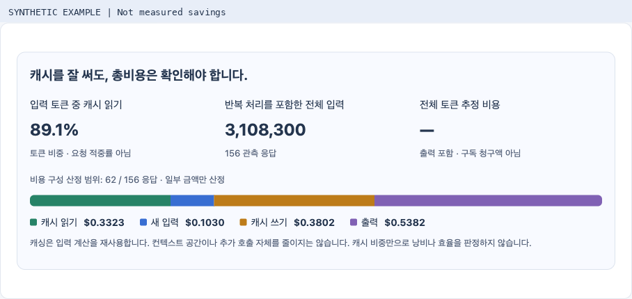
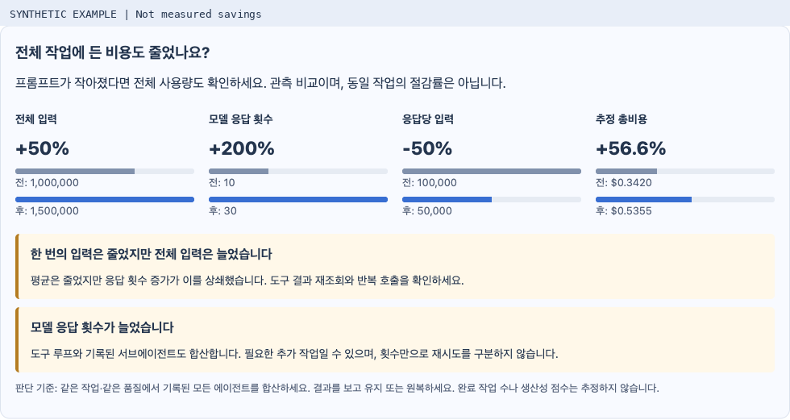

# 캐시와 전체 작업 비용을 함께 보기

[English](cache-economics.md) · [한국어 샘플 열기](https://niceysam.github.io/tracefrugal/?lang=ko)

캐싱은 실제로 도움이 됩니다. 일치하는 입력 앞부분의 계산을 재사용할 수 있습니다.
다만 캐시 입력도 컨텍스트 공간을 차지하고 추가 모델 호출에는 비용이 들 수 있습니다.
캐시 토큰 비중만으로 낭비나 효율을 판정할 수 없습니다.
TraceFrugal은 **캐시 토큰 비중·반복 처리를 포함한 전체 입력·범주별 추정 비용**을
같은 화면에 놓고 비교합니다.

목표는 같은 일을 제대로 끝내면서 전체 비용과 수고를 줄이는 것입니다.
프롬프트가 작아지는 것은 중간 지표일 뿐입니다.

이 문서의 화면은 **검증용 가상 예시**입니다. 실제 절감 실적이 아닙니다.

## 화면 읽는 순서

1. Claude Code 또는 Codex 기록 저장소와 기간을 선택합니다.
2. **캐시를 잘 써도, 총비용은 확인해야 합니다**에서 캐시 읽기·새 입력·캐시 쓰기·출력의
   비용 구성을 봅니다. 캐시 토큰 비중 90%가 비용 90% 절감이나 요청 적중률을 뜻하지 않습니다.
3. 세션을 열고 비교할 다른 세션을 선택합니다. 전체 입력·모델 응답 횟수·응답당 입력·추정 총비용을
   막대 네 쌍으로 비교합니다. 세션 이름으로 양쪽을 구분하며, 시간상 전후 관계를 가정하지 않습니다.
4. [로컬 최적화](local-optimizer.ko.md)에서 지원하는 변경을 적용하고 평소처럼 작업합니다.
   누적 입력·캐시 읽기 그래프와 만족도를 확인한 뒤 **유지 / 원복**을 선택합니다.
   응답당 입력 그래프도 펼쳐 볼 수 있습니다.

금액은 기록된 서브에이전트를 포함해 가격을 산정할 수 있는 각 응답의 범주별 금액을 합산합니다.
출력에 포함된 추론 토큰은 또 더하지 않습니다. 일부만 산정했으면 범위를 표시하고,
전체 가격이 없으면 총비용은 미산정으로 남깁니다. **Codex의 네이티브 사용량은 여전히 금액을 산정하지 않습니다.**
기존 날짜 기준 단가표를 사용하며 구독 청구액과 같지 않습니다.

## 어떤 신호를 보고 행동하나

| 관측 내용 | 의미 | 다음 행동 |
|---|---|---|
| 응답당 입력은 감소, 전체 입력은 증가 | 호출 증가가 작은 입력의 효과를 상쇄했습니다 | MCP 질의·반환 필드를 좁히고, 최신 결과를 재사용하며, 독립 조회를 묶고 반복 호출을 확인하세요 |
| 전체 입력 감소, 추정 비용 증가 | 토큰 감소가 비용 감소로 이어지지 않았습니다 | 캐시 읽기·쓰기·새 입력·출력량·적용 단가를 확인하세요 |
| 모델 응답 횟수 증가 | 추가 조회·에이전트·다른 작업이 비용을 늘렸을 수 있습니다 | 필요한 호출인지 확인하되 정확성 검증까지 줄이지 마세요 |
| 품질 저하 | 저렴해졌다는 이유만으로 성공이 아닙니다 | 실험 설정을 원복하고 빠진 근거나 재작업 원인을 확인하세요 |
| 기간·모델·가격·기록 범위 차이 | 변경의 효과를 분리해서 판단하기 어렵습니다 | 비교할 작업과 조건을 맞추고 누락을 확인하세요 |

추가 LLM이 진단하는 기능이 아닙니다. 관측 수치를 조건식으로 비교합니다.
캐시 비중이 줄었다고 만료·실패·입력 앞부분 변경 중 무엇이 원인인지 확정하지 않습니다.
MCP 서버를 끄기 전에 해당 CLI의 컨텍스트 분석과 도구 검색 지원 여부부터 확인하세요.
검토한 최신 Claude Code 지침은 MCP 정의를 지연 로딩하므로,
연결된 커넥터의 스키마가 매번 전부 포함된다고 가정하면 안 됩니다.

## 작아져도 비싸질 수 있는 예

**이해를 위한 가상 계산이며 측정 결과가 아닙니다.**

* 변경 전: 응답 10회 × 입력 1,000토큰 = 전체 입력 10,000토큰.
  변경 후: 30회 × 500토큰 = 15,000토큰.
  평균 입력은 50% 감소했지만 전체 입력은 50% 증가했습니다.
* 새 입력 $1/M, 캐시 읽기 $0.10/M이라는 가상 단가라면,
  캐시 입력 1M은 $0.10, 새 입력 0.5M은 $0.50입니다.
  토큰이 절반이어도 더 비쌉니다. 특정 제공자의 실제 단가가 아니며,
  이 계산 예에서만 출력과 캐시 쓰기를 생략했습니다.

[실제 CLI 시험](optimizer-validation.md)에서도 마지막 동일 지시 비교는 양쪽 정답 검증을 통과했지만,
설정 적용 후 입력 2.9% 감소와 함께 응답 2→3회, 소요 시간 증가가 나타났습니다.
캐시 구성도 달랐으므로 보편적인 절감 효과로 확정하지 않습니다.

## 자동으로 알아낼 수 없는 것

세션·사용자 턴·모델 응답을 완료된 작업으로 계산하지 않습니다.
사용 로그만으로 정답 여부·재시도·실제 작업 시간·생산성을 확정할 수 없습니다.
만족도와 완료 조건·테스트 통과는 따로 확인해야 합니다.
관측 기간은 달력상의 경과 시간이며 개발자나 모델이 실제 일한 시간이 아닙니다.
마지막 시간 구간은 일부만 포함할 수 있습니다.
누적 그래프가 평평하다는 것은 추가 입력 기록이 없다는 뜻이며, 절감의 증거가 아닙니다.
예전 실험 기록에 없던 비용 구성·에이전트 구분은 미확인으로 표시합니다.

기존 백업·정확한 원복·외부 편집 보호·이력 보존은 그대로 동작합니다.
원복은 이후 세션에 적용되며 사용 비용이나 이미 실행한 도구 작업을 되돌리지 않습니다.
이번 화면 때문에 설정을 자동 변경하거나, 제공자 모델을 호출하거나, 유료 평가를 실행하지 않습니다.

공식 근거는 2026년 9월 12일 확인한
[OpenAI 프롬프트 캐싱](https://developers.openai.com/api/docs/guides/prompt-caching),
[Claude 컨텍스트 창](https://platform.claude.com/docs/en/build-with-claude/context-windows),
[Claude Code 비용 안내](https://code.claude.com/docs/en/costs)입니다.
가격·캐시 정책·CLI 동작은 달라질 수 있으므로 특정 하네스가 항상 우수하다고 가정하지 않습니다.
