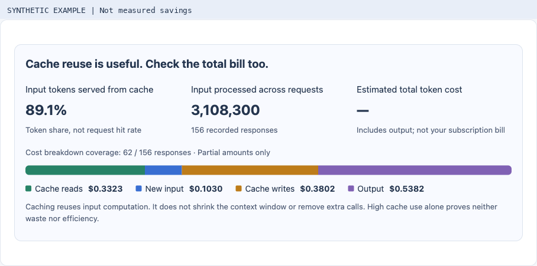
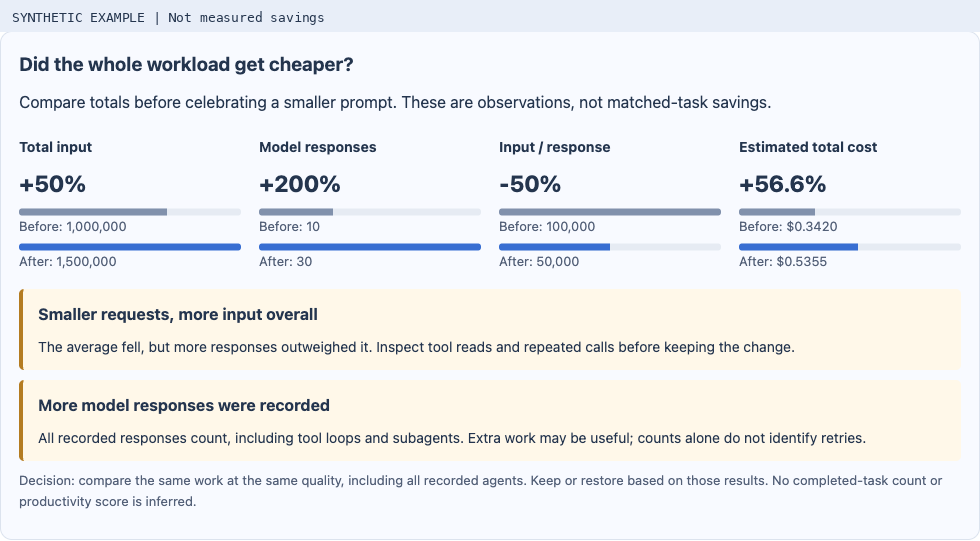

# Cache reuse and the cost of finishing work

[한국어](cache-economics.ko.md) · [Open the sample](https://niceysam.github.io/tracefrugal/?lang=en)

Caching is useful: a provider can reuse computation for a matching input prefix.
Cached input still occupies context, and additional model requests can still
incur charges. A high cache-token share proves neither waste nor efficiency.
TraceFrugal now places **cache-token share, total processed input, and estimated
category costs** together so they can be interpreted together.

The goal is to finish comparable work correctly with less total cost and effort.
A smaller prompt or fewer tokens is an intermediate measurement, not that goal.

Screenshots on this page use **synthetic UI examples**, not measured savings.

## Read the dashboard

1. Select a Claude Code or Codex log store and a period.
2. Check **Cache reuse is useful. Check the total bill too.** The colored bar
   splits known estimated cost into cache reads, new input, cache writes and
   output. A 90% cache-token share is not a 90% cost reduction or request hit rate.
3. Open a session and choose another for comparison. Four paired bars show
   total input, model responses, input per response and estimated total cost.
   Session names identify the two sides; they need not be chronological.
4. In the [local optimizer](local-optimizer.md), apply a supported change and
   work normally. Review the cumulative input/cache-read graph, quality ratings
   and **Keep / Restore** controls. The average-input chart remains available
   under a disclosure.

The cost estimate adds disjoint category amounts for all retained priced
responses, including recorded subagents. Reasoning tokens already included in
output are not added again. Partial price coverage is labeled; a mixed or
unpriced total is unavailable, never zero. **Native Codex remains unpriced.**
The existing dated price book and subscription limitations still apply.

## Warnings that change the decision

| Observation | What it means | What to try |
|---|---|---|
| Average input falls; total input rises | More responses outweighed smaller requests | Narrow MCP queries and returned fields; reuse current results; batch independent reads; inspect repeated calls |
| Total input falls; estimated cost rises | Token reduction did not lower the estimate | Inspect cache reads, writes, new input, output and effective model rates before changing context again |
| More model responses | Extra reads, agents or other work may add cost | Inspect their purpose; avoid rereading unchanged results, but retain checks needed for correctness |
| Quality falls | Lower cost is insufficient | Restore the trial setting and review missing evidence or extra rework |
| Periods, models, pricing or usage coverage differ | The comparison cannot isolate the change | Use comparable tasks and conditions; complete missing evidence before claiming savings |

These are deterministic observations, **not an LLM diagnosis**. Lower cache
reuse does not prove an expiry, miss or changing prefix from these logs alone.
Before disabling an MCP server, inspect the host's context breakdown and tool
discovery support. Modern reviewed Claude Code guidance defers MCP definitions;
an installed connector does not prove all its schemas are always included.

## Examples: smaller is not automatically cheaper

**Illustrative arithmetic, not measured results:**

* Before: 10 responses × 1,000 input tokens = 10,000 processed input tokens.
  After: 30 × 500 = 15,000. Average input fell 50%; total input rose 50%.
* With illustrative rates of $1/M new input and $0.10/M cached input,
  1M cached tokens cost $0.10, while 0.5M new input tokens cost $0.50.
  Fewer input tokens cost more. These are not any provider's advertised rates;
  output and cache writes are omitted only for this arithmetic example.

Our [real CLI fixture measurements](optimizer-validation.md) also show the
tradeoff: the final paired runs both passed the exact-answer check; applied
input fell 2.9%, but responses rose from 2 to 3 and elapsed time increased.
Cache composition differed. That is not a demonstrated general saving.

## What this release does not infer

A session, user turn or response is not automatically a completed task. Native
usage logs do not establish task correctness, retries, active working time or a
productivity score. Rate satisfaction and verify acceptance tests separately.
The observation window is elapsed calendar time, not developer or model time.
The last hourly bucket may be partial. A flat cumulative line means no additional
recorded input, not free work or savings. Historical baselines without new
category/agent details show those details as unavailable.

The optimizer still backs up and restores exact settings, protects external
edits, and retains history. Restoring affects future sessions; it cannot refund
usage or undo already executed tools. No new automatic settings changes,
provider calls or paid evaluations are introduced by this view.

## Sources

Reviewed September 12, 2026:

* [OpenAI prompt caching](https://developers.openai.com/api/docs/guides/prompt-caching)
* [Claude context windows](https://platform.claude.com/docs/en/build-with-claude/context-windows)
* [Claude Code cost guidance](https://code.claude.com/docs/en/costs)

Provider prices, cache policies and CLI behavior vary. Inspect the selected
version and actual recorded usage instead of treating one harness as universally
more efficient.
