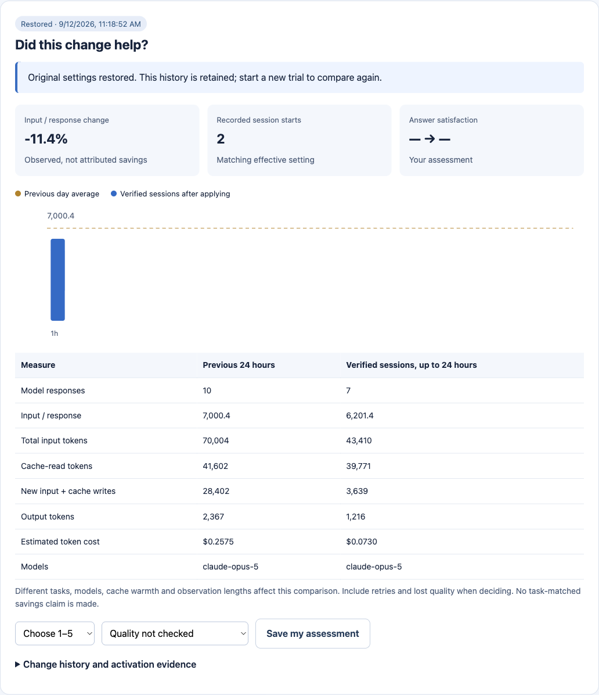

# Optimize your local Claude Code

[한국어](local-optimizer.ko.md) · [Measured CLI trials](optimizer-validation.md)

TraceFrugal changes a real setting in your project, observes subsequent usage,
and restores the original file on request. The browser is a loopback control
panel for a local Go process. There is no hosted optimizer or account to connect.

## Three steps

1. Download and extract [TraceFrugal](https://github.com/niceysam/tracefrugal/releases/latest).
   Keep the executable in a stable location. From the project you use with Claude:

   ```sh
   tracefrugal optimize --project .
   ```

   Use the full executable path if it is not on PATH. On Windows use
   `tracefrugal.exe`. The app prints its URL if a browser cannot open.
2. Check the displayed CLI path, version, project, official sources and preview.
   Click **Apply optimization · save backup**. Answer satisfaction is optional;
   leaving it blank means unmeasured.
3. Start a **fresh Claude session in that project**, using your normal terminal.
   Work normally. The panel displays activation evidence, hourly input per
   response, cache reads, new input, output, estimated cost and your quality
   assessment. Leave the change in place if it helps. Click **Restore original
   settings** if it does not. **Reapply as a new trial** preserves earlier history.

The app performs no model calls. Your ordinary Claude work still has its normal
provider/subscription costs. Closing the panel does not undo the setting.
Reopen the same command to catch up from retained logs.

## CLI selection matters

The first release of this recipe supports **Claude Code 2.1.268**. Other versions
remain diagnostic-only until separately reviewed and tested. Unit tests across
operating systems do not establish native CLI compatibility on each system.
No CLI upgrade, model change or authentication change is performed.

If your launcher uses a different binary or config store:

```sh
tracefrugal optimize --project /path/to/project \
  --claude-bin /path/to/claude \
  --claude-dir /path/to/claude-config
```

The default binary comes from PATH. The default store is `CLAUDE_CONFIG_DIR`,
otherwise `~/.claude`. A launcher may select another store; TraceFrugal cannot
infer every shell function's runtime behavior. Missing usage is not zero usage.
`tracefrugal doctor` accepts the same selection flags and prints a read-only
JSON diagnosis.

## What changes

Only the selected project's `.claude/settings.local.json`:

```json
{"env":{"MAX_MCP_OUTPUT_TOKENS":"6000"}}
```

Existing keys are preserved. A command-type `SessionStart` hook is appended to
record the effective limit and hashed session identity locally. It emits no
prompt text and reads no transcript content. Backups, document fingerprints,
activation receipts, aggregate usage and decisions stay in a private state
directory. `--state /private/path` selects a different directory.

Claude's native limit moves eligible oversized MCP text results into local
files and gives the agent a file reference. The agent must retrieve the useful
content. Tools with `anthropic/maxResultSizeChars` overrides are exempt; image
behavior follows Claude's limits. This is not a universal 6,000-token input cap.

**A saved MCP result may be plain text or wrap multiline text inside JSON.**
Reading “line 200” of a JSON file may not read line 200 of the underlying result.
Handle both formats or use an appropriate search. Additional reads can increase
calls and cost, and inadequate retrieval can lose information.

Tool search, model, effort, permissions, credentials and MCP connections remain
as configured. Current reviewed Claude guidance already defers MCP definitions
by default, so changing tool search to `auto:5` is not assumed to improve it.

## What is actually verified

At diagnosis, TraceFrugal probes `claude --version` and fetches four fixed
official documents: [MCP](https://code.claude.com/docs/en/mcp),
[settings](https://code.claude.com/docs/en/settings),
[hooks](https://code.claude.com/docs/en/hooks), and the
[release changelog](https://github.com/anthropics/claude-code/blob/main/CHANGELOG.md).
No project data is sent. Downloaded prose is never executed.

The recipe is compiled and reviewed, not generated from arbitrary web text.
Official docs are rolling documentation, **not version-pinned specifications**.
The version gate and real CLI trial provide additional evidence; marker checks
and document hashes alone do not prove semantic compatibility.

On apply, the binary version and original settings hash are checked again.
A session receipt verifies the setting in a launched process. Only matching
session usage with the reviewed version and exact project directory enters the
after sample. A receipt is not proof of lower billing or preserved quality.
Unmatched subagents, other stores and other versions are excluded.

## Compare carefully, then keep or undo

The comparison now leads with total estimated cost and four paired bars:
total input, response count, input per response and cost. It flags smaller
requests that add more input overall, or fewer input tokens with a higher
estimate. Cost-category bars and a cumulative input/cache-read graph give
context. See [cache economics](cache-economics.md) for examples and limitations.



This screenshot contains short fixture runs with unequal observation windows,
not a full-day or task-matched savings result. The [validation report](optimizer-validation.md)
lists the controlled-prompt pairs separately, including failures.

The baseline is the prior 24 hours in the exact project/store. Observation is
capped at the next 24 hours, or ends early on restore. Settings remain until
restored. Empty hours and missing logs are not savings. The app does not schedule
paid evaluations, email reports, or automatically grade reasoning.

Differences in tasks, models, cache warmth, retries and observation length can
explain changes. Check response counts as well as input per response: one smaller
request followed by five extra requests can cost more. Your before/after
satisfaction and task outcome are recorded separately from token observations.
If results deteriorate, restore even if input is smaller.

Restore recreates the **exact original bytes** and permissions, or removes a
newly created settings file. If you edit settings externally, automatic restore
refuses to overwrite your work. The original is in `<state>/<trial>/before.json`;
compare and merge it manually in that case. Do not publish backups: an existing
settings file may contain private values.

Restore affects future sessions. It cannot reconstruct previous model context,
reverse tools Claude already ran, or refund usage. Reapply starts a fresh
baseline and trial. Keep the TraceFrugal executable at the same path while its
hook is installed. If an interrupted process leaves `<state>/.lock`, first
ensure no TraceFrugal process is running, inspect history, then remove that
lock directory and use Restore to recover.

Codex usage remains available in the native dashboard. This recipe modifies
Claude Code only; it is not a universal cross-provider optimizer.
