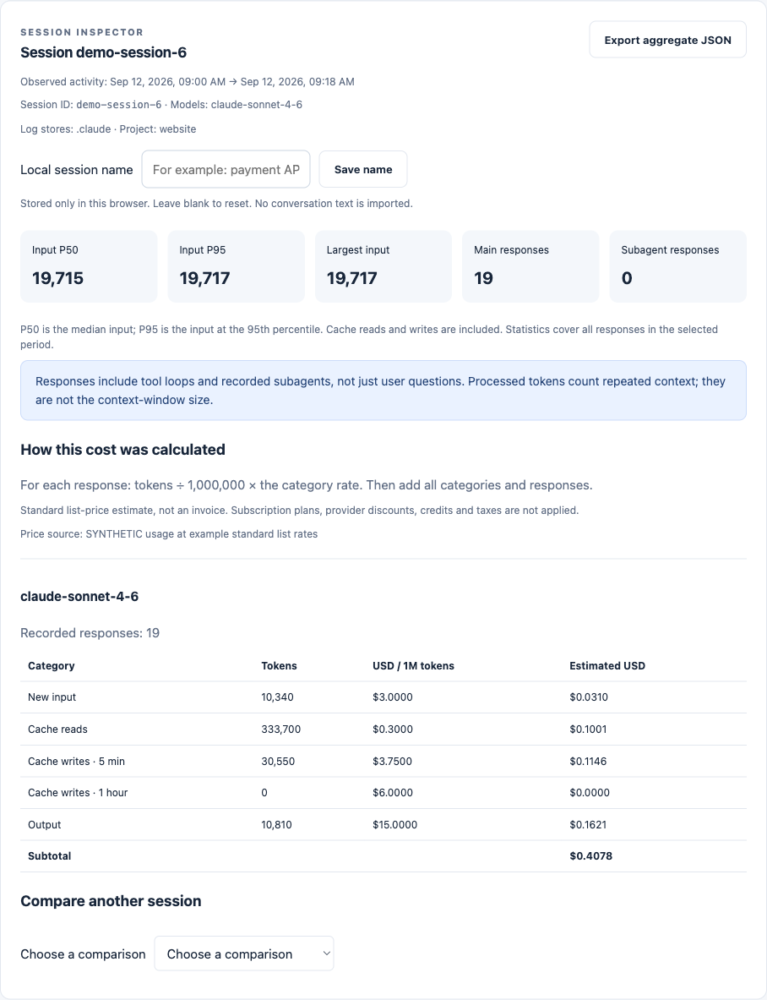

# Understand a session and its cost

[한국어](session-inspector.ko.md) · [English demo](https://niceysam.github.io/tracefrugal/?lang=en)

Run `tracefrugal`, choose a period, then select a session row. The graph shows
recent responses; the inspector uses **every retained response in the selected
period**, even when the timeline is capped. It is not necessarily the session's
entire lifetime.



## Identify the work

Rows distinguish sessions by ID, project, models and last activity. Two rows
named after the same project can contain completely different conversations.
Assign a recognizable name in **Local session name**, such as “payment API
investigation.” Names are stored only in this browser, on this origin. Changing
the port/browser or clearing site data can make them unavailable. A blank name
resets it. **Hide project names** hides names and aliases in the session views;
it is not a promise that every visible tool or source name is anonymous.

The inspector shows the first/last observed response, contributing log stores,
main/subagent response counts and input P50, P95 and maximum. Percentiles use
nearest rank, include cache reads/writes, and are computed before timeline
truncation. They describe request input, not unique conversation content.

## A short question can produce a lot of input

Input is what the model receives for **each request**, including retained
instructions, conversation, tool definitions and results. A generated answer,
patch or tool-call argument is output at generation time. If retained for a
later request, that content becomes input then. A tool's returned result is
data passed to the model, not model-generated output.

For an illustrative constant input of 100,000 tokens, ten model requests
process 1,000,000 input tokens. One user question may trigger several model
requests around tool calls. Real context can grow, be trimmed or compacted.
Caching can lower the applicable rate, but cached tokens still count as input
and a hit is not guaranteed. Terminal formatting, diffs and truncated previews
are not a reliable billing counter.

Use the dashboard's **My question was short** explainer and request slider.
Sources: OpenAI's [tool-calling flow](https://developers.openai.com/api/docs/guides/function-calling)
and [prompt caching](https://developers.openai.com/api/docs/guides/prompt-caching),
read September 12, 2026. Availability and prices depend on the model/provider.

## Check the math

For each priced response and disjoint billing category:

```text
category USD = category tokens / 1,000,000 × USD per million
response USD = new input + cache reads + 5-minute writes + 1-hour writes + output
session USD = sum of priced responses in the selected period
```

The inspector groups responses by **model and effective category rates**.
Different rates are never merged just because the model matches. Geography
multipliers, when supported, are already reflected in the displayed rates.
The dated bundled price book is a standard list-price estimate. It does not
apply subscriptions, negotiated discounts, credits, tax or provider-specific
billing terms. This release makes the existing price book transparent; it
does not claim to refresh its prices automatically.

Unrecognized models, unknown cache-write lifetimes and unsupported pricing
tiers remain unpriced with a reason. Native Codex usage remains unpriced.
Unknown costs are **not zero dollars**. Mixed totals are labeled known
subtotals; the cost graph shows a gap where coverage is incomplete.

## Compare and act

**Compare another session** puts response counts, mean/P95 input, cache reads,
output and cost side by side. More requests and different models or task
difficulty can explain a bigger bill. Comparing sessions does not establish
causal savings or equal answer quality.

Use observed tool-result bytes and repeated-call signals to narrow fields and
pages, reuse current results, batch independent reads or try the opt-in
[MCP result proxy](mcp-pack.md). For schemas, use tool discovery when supported
and the host's context inspector. These usage logs cannot measure exactly how
much input came from schemas, user text, instructions or history.

Use a scoped 24-hour trial and record answer/reasoning satisfaction. For
stronger evidence, repeat comparable tasks and check correctness. Lower input
alone is not a successful outcome.

**Export aggregate JSON** includes session ID, timestamps, models, totals,
percentiles and price groups. It excludes project names, aliases, raw timelines,
prompts and tool bodies. It is intended for inspection, not the separate API
report import screen. Model IDs and usage times can still be sensitive.

## Language

Both native and API dashboards support **English / 한국어**. Choose in the
header. A `?lang=en` or `?lang=ko` URL takes precedence, followed by the saved
browser choice, then browser language. Code, model/tool IDs and user names
stay literal. The interface is translated offline; no translation API runs.
